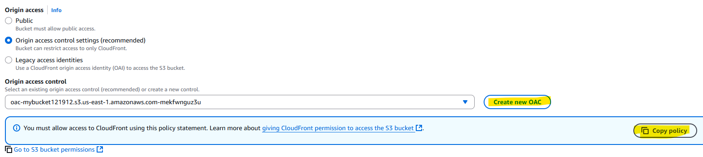

# CloudFront

CloudFront is a content delivery network (CDN) service offered by Amazon Web Services (AWS). It distributes content, like web videos and other bulky media, to users from locations geographically closer to them, improving download speeds and overall user experience. Essentially, CloudFront caches content at various edge locations around the world, enabling faster access for users regardless of their location. 

# How It Works
CloudFront works by caching copies of your content at edge locations around the world. When a user requests content, CloudFront routes the request to the nearest edge location, which reduces latency and speeds up delivery. If the content is not already cached at that edge location, CloudFront retrieves it from the origin server (like an S3 bucket or an EC2 instance), caches it, and then serves it to the user.    
This process ensures that subsequent requests for the same content are served quickly from the cache, minimizing the load on the origin server and improving response times for users.

 

### Origin (S3 Bucket in this case)
The S3 bucket stores the actual static website files or assets. CloudFront fetches these files from the S3 bucket when a user requests them for the first time or when they are not cached at the edge location.
### CloudFront Distribution
The distribution acts as the entry point that routes requests from users to the correct origin. It also applies caching policies, behaviors, and security settings.
### Cache Propagation
When a user requests content that is not cached at the edge location, CloudFront fetches it from the origin (S3 bucket) and caches it for future requests. This process is known as cache propagation, and it ensures that content is quickly available to users in subsequent requests.
### Edge Locations
Edge locations are data centers located around the world where CloudFront caches content. When a user requests content, CloudFront routes the request to the nearest edge location, reducing latency and improving download speeds.
### Users
Users are the end clients who access the content served by CloudFront. They can be web browsers, mobile applications, or any other client that requests content from the CDN.

# Benefits of Using CloudFront
- **Improved Performance**: By caching content at edge locations, CloudFront reduces latency and speeds up content delivery to users.
- **Scalability**: CloudFront can handle large amounts of traffic and automatically scales to accommodate spikes in demand without requiring manual intervention.
- **Security**: CloudFront integrates with AWS Shield for DDoS protection and AWS WAF for web application firewall capabilities, enhancing the security of your content delivery.
- **Cost-Effective**: CloudFront's pay-as-you-go pricing model allows you to only pay for the data transfer and requests you actually use, making it a cost-effective solution for content delivery.

# Getting Started with CloudFront
To get started with CloudFront, follow these steps:
1. **Create an S3 Bucket**: Store your static website files or assets in an S3 bucket.

2. **Create a CloudFront Distribution**: In the AWS Management Console, navigate to CloudFront and create a new distribution. Select your S3 bucket as the origin.

Set the default root object to `index.html` if you're serving a static website by clicking on edit. wait for the distribution to deploy, which may take a few minutes.

3. **Configure Cache Behaviors**: Set up cache behaviors to define how CloudFront caches and serves your content. You can specify caching policies, TTL (time-to-live) settings, and more.

By default, CloudFront caches content for 24 hours. You can adjust the cache TTL settings based on your content update frequency.

4. **Origin Access Identity (OAI)**: If you want to restrict access to your S3 bucket, create an OAI and associate it with your CloudFront distribution. This ensures that only CloudFront can access your S3 bucket.

You can either create a new OAI or use an existing one. If you create a new OAI, make sure to update your S3 bucket policy to allow access from the OAI.

Paste the generated OAI in your S3 bucket policy to allow CloudFront to access your content.

5. **Test Your Distribution**: Once your distribution is deployed, test it by accessing the CloudFront URL. You should see your static website or content being served from the edge locations.

6. **Cache Invalidation (Optional)**: If you update your content in the s3 bucket and try to access it through CloudFront, you may not see the changes immediately due to caching. By default, CloudFront caches content for 24 hours. In this case, you can create a cache invalidation request to remove the cached content from CloudFront.

You can specify the paths to invalidate, such as `/*` to invalidate all cached content or specific files like `/index.html`.
Now, when you access the CloudFront URL, you should see the updated content.

# CloudFront Origin Types
CloudFront supports various origin types to serve content, including:
- **Amazon S3 Bucket**: Host static websites, images, videos, CSS/JS, etc. You can use Origin Access Control (OAC) or Origin Access Identity (OAI) to restrict bucket access.
- **Custom HTTP Origin**: Any web server, such as an Application Load Balancer (
ALB), Network Load Balancer (NLB), or an EC2 instance running Apache, Nginx, Node.js, etc. It can even be a server outside AWS (on-premises or another cloud).
- **Amazon Media Services**: Services like AWS MediaPackage or MediaStore for video streaming,
useful for live or Video on Demand (VOD) streaming.
- **API Gateway**: CloudFront can front REST APIs or HTTP APIs from Amazon API Gateway, improving performance globally, caching API responses, and reducing latency.
- **AWS Elastic Beanstalk**: If your Beanstalk application is running a web server, CloudFront can accelerate it.
- **Lambda / Lambda@Edge**: CloudFront can trigger Lambda@Edge functions to customize requests/responses, such as URL rewrites, authentication, header manipulation, etc.
- **CloudFront Functions**: Lightweight JavaScript functions that run at the edge to process HTTP requests/responses. They are good for tasks like redirects, security headers, etc.

# 🚀 Real-World Examples
Here are some common use cases for CloudFront:
- **Static Website Hosting**: Use CloudFront with an S3 bucket to host static websites, serving HTML, CSS, JavaScript, images, and other static assets. This setup provides low latency and high availability.
- **Dynamic Web Applications**: Use CloudFront with an Application Load Balancer (ALB) to accelerate dynamic web applications hosted on EC2 or ECS. CloudFront caches dynamic content and reduces the load on the origin servers.
- **Streaming Video**: Use CloudFront with AWS MediaPackage to deliver live or on-demand video content. CloudFront caches video segments at edge locations, providing a smooth streaming experience for users.
- **API Acceleration**: Use CloudFront with Amazon API Gateway to accelerate API responses, reduce latency, and improve performance for REST APIs or HTTP APIs. CloudFront caches API responses, reducing the load on the backend services.
- **Hybrid Applications**: Use CloudFront to serve static assets from S3 while routing dynamic content requests to an ALB or API Gateway. This setup allows you to leverage the benefits of both static and dynamic content delivery, improving performance and user experience.    

# Conclusion
CloudFront is a versatile and powerful CDN service that enhances content delivery performance, scalability, and security. By caching content at edge locations, it reduces latency and improves user experience for various types of applications, including static websites, dynamic web applications, video streaming, and API acceleration. Its integration with other AWS services and its extensive features make it a preferred choice for businesses looking to enhance their content delivery capabilities. Whether you're hosting a static website, delivering dynamic content, or streaming media, CloudFront provides the tools and flexibility to meet your content delivery needs efficiently.