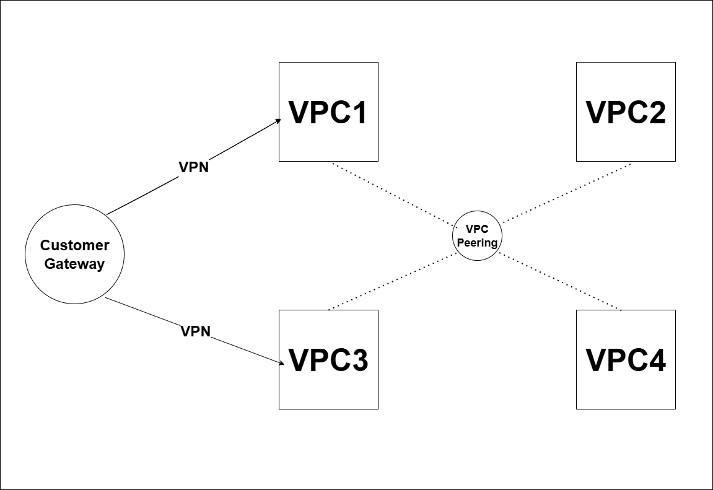

# Virtual Private Cloud 

A **VPC (Virtual Private Cloud)** is a private, isolated network you create within a cloud provider’s infrastructure.  
In **AWS**, it’s your own customizable section of the AWS network.  

## 🚀 Why VPC?  
- Your resources are protected from other AWS customers. 
- Full control over IP ranges, routing, and access. 
- Can expand with more subnets, gateways 

## VPC 

  

**Region** – Select any AWS region that has multiple Availability Zones (3 or 6).  

**Availability Zones (AZs)** – Based on the number of servers you require, you first select an appropriate IP address range for your VPC. This range is defined using a **CIDR block**. You can then divide this range into multiple subnets as needed. Each subnet can be assigned to a specific Availability Zone or distributed across zones.  

**CIDR (Classless Inter-Domain Routing)** – A method to allocate IP addresses.  

**Example:**  
We need ~4000 servers (4056 ≈ 2^12) and want to divide them into 6 subnet groups (each with ~524 servers).  
- Project IP range: `10.0.0.0/19`  
- Subnet groups IP ranges:  
  - `10.0.0.0/22`  
  - `10.0.4.0/22`  
  - `10.0.8.0/22`  
  - `10.0.12.0/22`  
  - `10.0.16.0/22`  
  - `10.0.20.0/22`  

**Subnet Groups** – Used to logically divide and organize network resources.  
- **Public Subnet**: Accessible from the Internet Gateway (IG).  
- **Private Subnet**: Accessible only through public subnet resources.

## 🔌 Communication Within VPC  

AWS networking components that enable communication:

- **Internet Gateway**: This is present outside our VPC, which is connected to the public router. Any person will be able to access VPC via IG.  
- **Router**: All the communication within the subnets will be handled by the routers. Each subnet (either public or private) will be connected to one router (one-on-one communication).  

When a VPC is created, a default router will be created connecting all subnets (such that each subnet is connected to one router). We can create n-number of routers for n-subnets. We can connect to the public subnets only if the router associated with the subnets is connected to IG.  

The outside world cannot access the private subnet. The private subnets can be accessed only from the inside. The private subnets do not require any medium to access the public subnets. Servers within public subnets need NAT to access private subnets.  

- **NAT**: A process that modifies network address information in IP packet headers while they are in transit across a routing device. It's commonly used to map multiple devices on a private network to a single public IP address for internet access. A NAT server can be placed in any public subnet.  

- **NACL**: It's a virtual firewall that acts as a security layer for the subnets, controlling inbound and outbound traffic. Think of it as a set of rules that determine which traffic is allowed or denied to enter or leave a subnet.  

- **Security Group (SG)**: A security group for a web server acts as a virtual firewall, controlling the inbound and outbound traffic allowed to the server. It defines rules that specify which network protocols, ports, and sources are permitted to communicate with the web server.  
  

**Traffic Flow:**

**Request → AWS → IG → Router → NACL → SG → Server → Firewall → End Application** 

## 🔒 Security in VPC  

Both **NACLs** and **Security Groups** provide protection, but at different levels:  

| Feature            | NACL                          | Security Group (SG)            |
|--------------------|-------------------------------|--------------------------------|
| Level              | Subnet                        | Instance (server)              |
| Rules              | Allow + Deny                  | Allow only (default deny)      |
| Use Case           | Broad subnet rules            | Fine-grained instance rules    |

## Communication among VPCs  

VPCs are isolated by default, but AWS provides mechanisms for inter-VPC communication:  

### 1. **VPC Peering**

- **Definition**: A networking connection between two VPCs that enables traffic routing using private IPv4 or IPv6 addresses.  
- **Use Case**: Best suited for simple, one-to-one communication between VPCs.  
- **Limitations**:  
  - Peering does not support transitive routing (if VPC-A peers with VPC-B, and VPC-B peers with VPC-C, A cannot automatically reach C).  
  - Each peering connection must be established individually.   

### 2. **Transit Gateway (TGW)**

- **Definition**: A central hub that enables communication between multiple VPCs, on-premises networks, or even across regions.  
- **Use Case**: Best for large-scale architectures with many VPCs (hub-and-spoke model).  
- **Advantages**:  
  - Simplifies complex peering relationships.  
  - Supports transitive routing.  
  - Scales well with growing cloud networks.  

### 📊 Comparison  

| Feature            | VPC Peering                  | Transit Gateway                |
|--------------------|------------------------------|--------------------------------|
| Scale              | Small (few VPCs)             | Large (many VPCs)              |
| Routing            | No transitive routing        | Supports transitive routing    |
| Setup              | Individual connections       | Centralized hub-and-spoke      |
| Best Use Case      | Simple connections           | Enterprise-scale networking    |

## 🔄 Communication among Different AWS Groups  

In addition to VPC-to-VPC communication, AWS provides several mechanisms for enabling **secure communication among different resource groups and services** inside the cloud.  

### 1. **VPC Endpoints**  

  

- **Definition**: Enables private connections between a VPC and supported AWS services **without using the Internet Gateway, NAT, VPN, or Transit Gateway**.  
- **Types**:  
  - **Interface Endpoints** – Elastic Network Interfaces (ENIs) with private IPs for services like S3, DynamoDB, etc.  
  - **Gateway Endpoints** – Used for S3 and DynamoDB.  
- **Use Case**: Securely access AWS services from private subnets.  

---

### 2. **PrivateLink**  

  

- **Definition**: Provides **private connectivity** between VPCs, AWS services, and on-premises applications.  
- **Use Case**: Securely expose a service running in one VPC to other VPCs **without VPC peering or Transit Gateway**.  
- **Benefit**: Keeps traffic inside the AWS network.  

---

### 3. **VPN Connections**  

  

- **Definition**: A secure, encrypted tunnel between your **on-premises network** and your AWS VPC.  
- **Use Case**: Hybrid cloud setups where some workloads are on-premises and others in AWS.  

---

### 4. **Direct Connect (DX)**  

  

- **Definition**: A dedicated private network connection from your on-premises environment to AWS.  
- **Use Case**: High-bandwidth, low-latency workloads such as data transfer, backups, and enterprise apps.  
- **Advantage**: More reliable and cost-effective than VPN for large-scale usage.  

---

### 📊 Comparison  

| Feature             | VPC Endpoints                | PrivateLink                   | VPN Connection                 | Direct Connect (DX)            |
|---------------------|------------------------------|-------------------------------|--------------------------------|--------------------------------|
| Scope               | VPC ↔ AWS Service            | VPC ↔ VPC/Service             | On-Premises ↔ AWS              | On-Premises ↔ AWS              |
| Connectivity Type   | Private, managed             | Private, service exposure     | Encrypted tunnel over Internet | Dedicated private line         |
| Performance         | High (internal AWS network)  | High (internal AWS network)   | Medium (depends on internet)   | Very High (dedicated fiber)    |
| Best Use Case       | Access S3/DynamoDB privately | Share internal services       | Hybrid workloads (secure)      | Large-scale enterprise traffic |

---

## ✅ Extended Summary  

- **Within a VPC** → Subnets, Routers, IG, NAT, NACLs, SGs manage communication.  
- **Across VPCs** → Use **Peering** for simple links or **Transit Gateway** for enterprise-scale.  
- **Across AWS Services (Groups)** →  
  - **VPC Endpoints** for S3/DynamoDB access inside private subnets.  
  - **PrivateLink** to expose internal services privately.  
  - **VPN** for secure hybrid cloud over the internet.  
  - **Direct Connect** for high-performance hybrid networking.  
