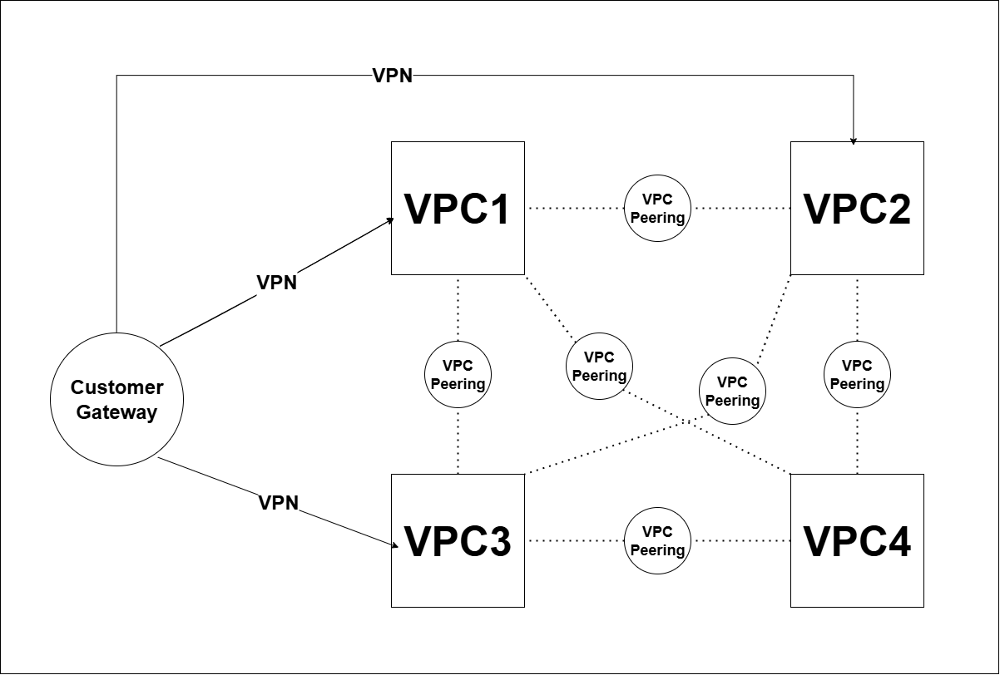

# Virtual Private Cloud 

A VPC is a private, isolated network you create within a cloud provider’s infrastructure — in AWS, it’s your own customizable section of the AWS network. 

## Why VPC? 
- Your resources are protected from other AWS customers. 
- Full control over IP ranges, routing, and access. 
- Can expand with more subnets, gateways 

## VPC 

**Region** - Select any AWS region that has multiple Availability Zones (3 or 6).  

**Availability Zones** - Depending on the number of servers you require, you first select an appropriate IP address range for your VPC. This range is defined using a CIDR block. You can then divide this range into multiple subnets as needed. Each subnet can be assigned to a specific Availability Zone or distributed across zones.  

**CIDR (Classless Inter-Domain Routing)** - method to allocate IP address.  

**Example:** We need 4000 (4056 ~ 2^12) servers for our project and we want to divide into 6 subnet groups (each with 524 servers).  
- Project IP range: `10.0.0.0/19`  
- Subnet groups IP range:  
  - `10.0.0.0/22`  
  - `10.0.4.0/22`  
  - `10.0.8.0/22`  
  - `10.0.12.0/22`  
  - `10.0.16.0/22`  
  - `10.0.20.0/22`  

**Subnet groups**: Subnet groups within a Virtual Private Cloud (VPC) are used to logically divide and organize network resources for security and operational purposes. A subnet can be either private or public.  

- **Public Subnet**: It is open and can be accessed through Internet Gateway (IG). Any person with internet access will be able to access this subnet unless blocked.  
- **Private Subnet**: Only the servers within the public subnet will be able to access the private subnet unless blocked.  

## How to communicate with VPC or communication within VPC  

**Routers, IG, NAT (Network Address Translation), NACL (Network Access Control List)**  

- **Internet Gateway**: This is present outside our VPC, which is connected to the public router. Any person will be able to access VPC via IG.  
- **Router**: All the communication within the subnets will be handled by the routers. Each subnet (either public or private) will be connected to one router (one-on-one communication).  

When a VPC is created, a default router will be created connecting all subnets (such that each subnet is connected to one router). We can create n-number of routers for n-subnets. We can connect to the public subnets only if the router associated with the subnets is connected to IG.  

The outside world cannot access the private subnet. The private subnets can be accessed only from the inside. The private subnets do not require any medium to access the public subnets. Servers within public subnets need NAT to access private subnets.  

- **NAT**: A process that modifies network address information in IP packet headers while they are in transit across a routing device. It's commonly used to map multiple devices on a private network to a single public IP address for internet access. A NAT server can be placed in any public subnet.  

- **NACL**: It's a virtual firewall that acts as a security layer for the subnets, controlling inbound and outbound traffic. Think of it as a set of rules that determine which traffic is allowed or denied to enter or leave a subnet.  

- **Security Group (SG)**: A security group for a web server acts as a virtual firewall, controlling the inbound and outbound traffic allowed to the server. It defines rules that specify which network protocols, ports, and sources are permitted to communicate with the web server.  

Both Network Access Control Lists (NACLs) and Security Groups are used to control network traffic, but they operate at different levels and have distinct characteristics.  
- NACLs operate at the subnet level.  
- Security Groups operate at the instance level (servers within subnets).  

NACLs support both allow and deny rules, enabling you to explicitly block specific traffic. Security groups only allow traffic; implicitly deny everything else.  

**Traffic Flow:**

**Request → AWS → IG → Router → NACL → SG → Server → Firewall → End Application**  

## Communication among VPCs  

VPCs are isolated by default, but AWS provides mechanisms for inter-VPC communication:  

### 1. **VPC Peering**

- Connects two VPCs using private IP addresses.  
- Allows resources in different VPCs to communicate as if they are in the same network.  
- Peering is **non-transitive** (if VPC-A is peered with VPC-B, and VPC-B with VPC-C, A cannot talk to C).  
- Best for small-scale setups with limited interconnections.  

### 2. **Transit Gateway (TGW)**
- A central hub that connects multiple VPCs and on-premises networks.  
- Scalable solution for managing complex network topologies.  
- Supports **transitive routing** (VPC-A → TGW → VPC-B → VPC-C).  
- Recommended for enterprise-scale architectures.  

### 3. **VPC Endpoints**
- Enables private connectivity between VPCs and AWS services **without using the public internet**.  
- Two types:
  - **Interface Endpoint** (powered by PrivateLink).  
  - **Gateway Endpoint** (for S3, DynamoDB).  

### 4. **VPN & Direct Connect**
- For communication between **on-premises data centers** and VPCs.  
- VPN uses encrypted tunnels over the internet.  
- Direct Connect offers a dedicated private connection.  

